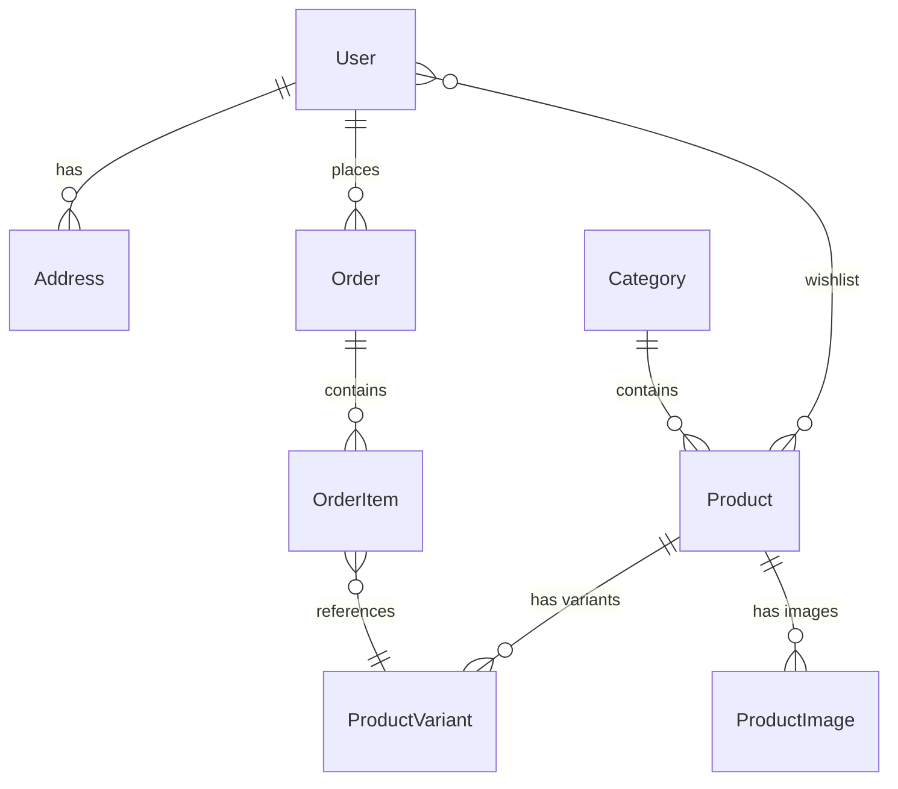

# LUXE. — Premium E-Commerce Platform


**LUXE.** is a premium fashion e-commerce platform built with Django. This project implements a professional, modular architecture featuring a product catalog with variants (sizes/colors), a session-based shopping cart, full order management, a wishlist system, and a high-end UI inspired by luxury fashion brands.

---

## ✨ Features

### 🛍️ Product Catalog
- Product catalog with **images**, descriptions and pricing
- **Variant system** (size, color) with independent stock management per variant
- **Categories** with dynamic filtering
- **Search** by product name and description (Django Q objects)
- **Pagination** (12 products per page)

### 🛒 Shopping Cart (Session-based)
- Cart stored in **browser sessions** — no account required to start shopping
- Add, update quantity and remove items
- Dynamic item counter in the navigation bar
- Automatic total calculation

### 👤 Authentication & User Profile
- Registration, login and logout
- Custom user model (`AbstractUser`) with phone number
- **Shipping address** management (add, set default)
- **Order history** with full details displayed in the profile

### ❤️ Wishlist (Favorites)
- Add/remove favorites directly from **product cards** (heart icon overlay)
- Add/remove from the **product detail** page
- Dedicated wishlist page at `/users/wishlist/`
- **Dynamic counter badge** on the heart icon in the navigation bar

### 📦 Orders & Checkout
- Checkout form with **smart auto-fill** from saved default address
- Automatic creation of `Order` and `OrderItem` records
- **Automatic stock deduction** after order confirmation
- Order confirmation page with summary
- Payment method: Cash on Delivery

### 🎨 Premium UI/UX
- Monochrome design system inspired by luxury fashion brands
- **Tailwind CSS** for fully custom styling
- **Micro-animations** (fade-in, hover scale, smooth transitions)
- **Responsive design** with mobile hamburger menu
- Inter typography (Google Fonts)
- Sticky navigation bar with backdrop blur effect

---

## 🏗️ Project Architecture

The project follows Django's **MVT** (Model-View-Template) architecture and is split into 5 modular apps:

```
ecommerce/
├── ecom_project/          # Django configuration (settings, urls)
├── core/                  # Homepage, global views
├── users/                 # Authentication, profiles, addresses, wishlist
├── products/              # Catalog, categories, variants, images
├── cart/                  # Shopping cart logic (session-based)
├── orders/                # Checkout, orders, order items
├── templates/             # Global templates (base.html)
├── static/                # Static files (images, CSS)
├── media/                 # Uploaded files (product images)
└── manage.py
```

---

## 📊 Data Models



| Model | Description |
|---|---|
| `User` | Custom user with phone number and wishlist (ManyToMany) |
| `Address` | Shipping addresses (street, city, postal code, country) |
| `Category` | Product categories with auto-generated slug |
| `Product` | Product with name, description, base price, slug |
| `ProductVariant` | Variant per product (size, color, stock, price modifier) |
| `ProductImage` | Multiple images per product |
| `Order` | Order with customer info and total amount |
| `OrderItem` | Order line item (variant, frozen price, quantity) |

---

## 🔐 Security

- **CSRF** protection on all POST forms
- Passwords hashed by default (Django password hashing)
- `@login_required` decorator on protected views
- Server-side form validation

---

## 🚀 Installation & Setup

### Prerequisites
- Python 3.11+
- pip

### Steps

```bash
# 1. Clone the repository
git clone <repo-url>
cd ecommerce

# 2. Create and activate virtual environment
python -m venv venv

# Windows
venv\Scripts\activate

# macOS/Linux
source venv/bin/activate

# 3. Install dependencies
pip install django django-widget-tweaks Pillow

# 4. Apply migrations
python manage.py makemigrations
python manage.py migrate

# 5. Create a superuser (admin)
python manage.py createsuperuser

# 6. (Optional) Seed the database with sample products
python seed.py

# 7. Start the development server
python manage.py runserver
```

### Access
- **Website**: http://127.0.0.1:8000/
- **Admin Panel**: http://127.0.0.1:8000/admin/

---

## 📁 Dependencies

| Package | Version | Purpose |
|---|---|---|
| Django | 5.2 | Core web framework |
| Pillow | Latest | Image handling (ImageField) |
| django-widget-tweaks | 1.5+ | Styling Django forms with Tailwind CSS classes |

---

## 🛣️ URL Routes

| URL | Description |
|---|---|
| `/` | Homepage (Landing page) |
| `/products/` | Shop (full product catalog) |
| `/products/<slug>/` | Product detail page |
| `/cart/` | Shopping cart |
| `/orders/checkout/` | Checkout page |
| `/users/register/` | User registration |
| `/users/login/` | User login |
| `/users/logout/` | User logout |
| `/users/profile/` | User profile & order history |
| `/users/wishlist/` | Wishlist (favorites) |
| `/admin/` | Django admin interface |

---

## 🛠️ Tech Stack

- **Backend**: Django 5.2 (Python 3.11)
- **Frontend**: Tailwind CSS (CDN), HTML5, Vanilla JavaScript
- **Database**: SQLite (development)
- **Typography**: Inter (Google Fonts)
- **Forms**: django-widget-tweaks
- **Image Processing**: Pillow

---

## 👨‍💻 Author

Built as a final module exam (EFM) project.

---

## 📄 License

This project is intended for educational purposes.
